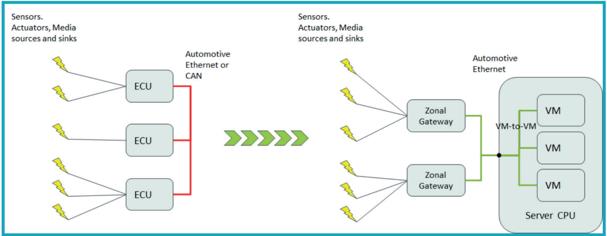
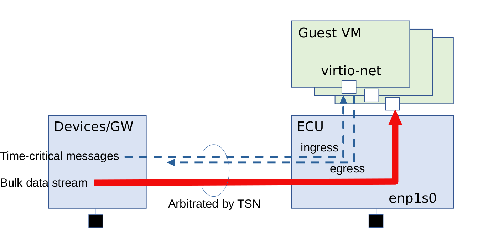
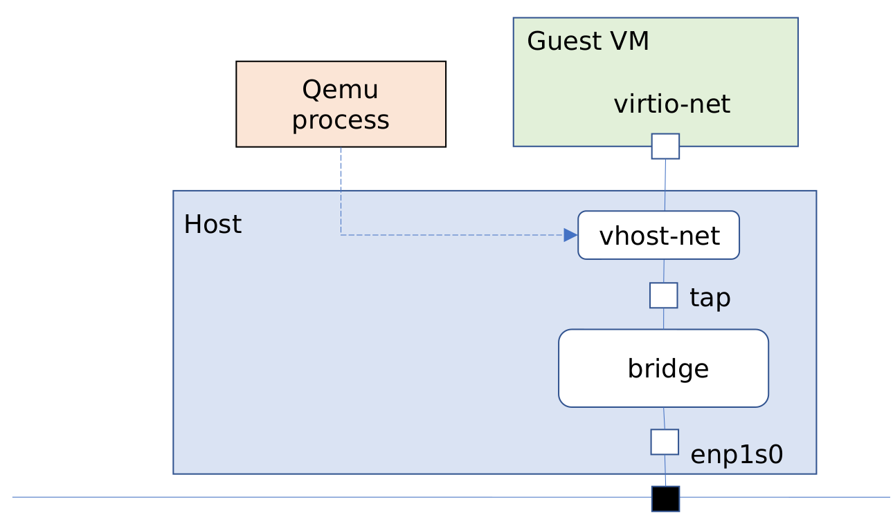
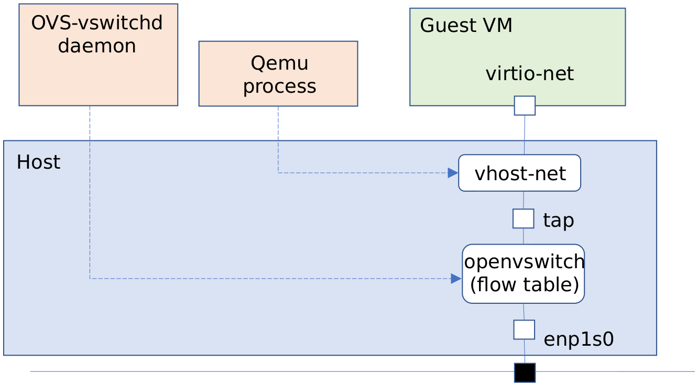
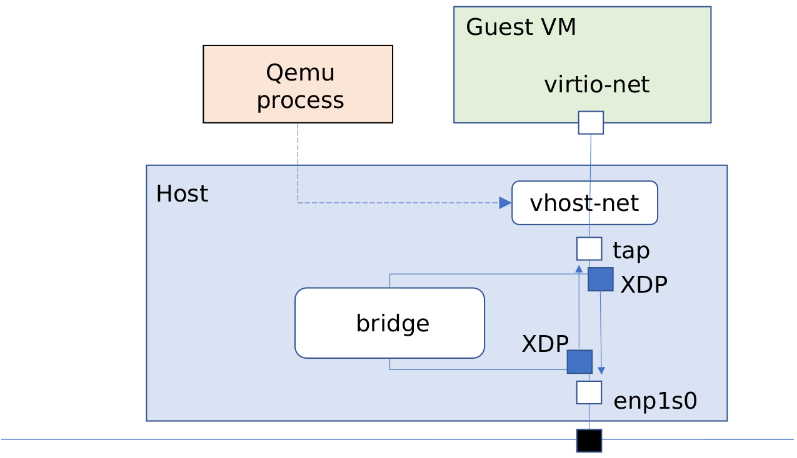
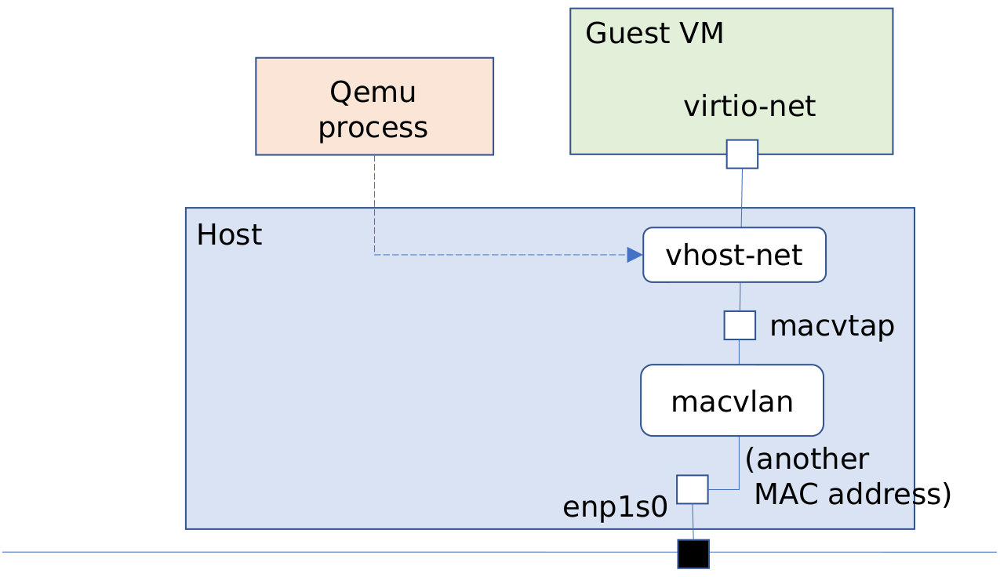
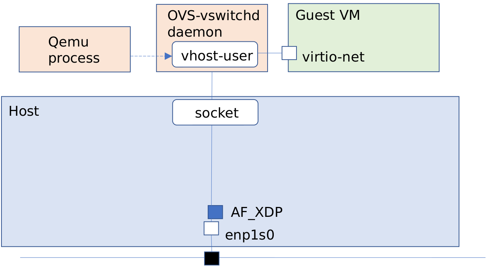
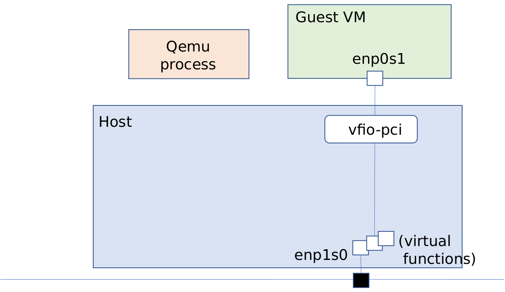

===========================================
Network Latency with TSN on Virtual Machine
===========================================

This blob series will describe our experiments in evaluating network latency with
IEEE802.1 TSN (Time Sensitive Networking)[1] technology, especially under virtual
machine (hypervisor) environment.

Background
==========
Nowaday, Software Defined Vehicle (SDV) has been getting momentum in automotive
industry. As a modern vehicle is equipped with more automotive functions from legacy
powertrain/chassis control to infotainment and ADAS and even connected to outside
world via cloud infrastructure for supporting value-added services, more and more
software components have been integrated in building and creating a modern vehicle.

Linaro's white paper[2] surveys this trend, summarises architectural transformation
along with standardized technologies being deployed in this segment and illustrates
challenges that we are facing now and in the near future.

In the traditional systems, fixed-function ECUs are connected directly to the sensors,
relays and actuators, creating purpose-specific domains. As a massive number of ECUs
(probably more than hundreds) will be installed in a single car, those ECUs will be
replaced by and integrated into a small number of centralized ECU servers and
applications running on ECUs will eventually be hosted on mutually-isolated
virtual machines.

Electric devices including sensors/actuators will be then connected to virtual machines on
the servers via zonal gateways. Networks between devices/gateways and ECUs are also being
converged and replaced from traditional CANbus technology to standard ethernet which will
bring in a single unified bus as system-wide networking, simplifying the complexity of
network management and reducing a total cost of physical wiring.

  fig. zonal architecture

TSN and Performance
===================

When ethernet protocol is used in real-time environment, its best effort nature
won't best fit to what the automotive applications expect to achieve for
data exchanges over the network. Here is Time Sensitive Networking (TSN).

TSN is a collection of standards defined by IEEE801.2 and seen as extensions to
IEEE801.Q (VLAN), addressing issues like network latency and robustness.
TSN provides the predictable nature of real-time communications where particular
packets are expected to be delivered within a specific time with minimum jitters
whereas other low-priority traffic are also allowed at best-effort basis.

TSN includes several features like:

- clock synchronization (Precision Time Protocol, or PTP):

  all the clocks on the devices connected to the network, including NICs and routers,
  will be synchronized to behave based on shared time reference.

- various network schedulers/shapers:

  Credit-based scheduler (cbs or Qav) provides fair scheduling, allowing managed
  bandwidth for each traffic, while time-aware shaper (tas or Qbv) enforces
  deterministic delivery under strict packet gate controls.
  They are well known schedulers but there are more related technologies.

- resource management protocol (SRP):

- multiple paths and frame replication:

With those technologies combined and properly configured, some level of determinism
in packet delivery is guaranteed. This determinism is, however, limited at hardware
or mac layer. As more software components, along with kernel or hypervisor
interventions, get stacked both on sender side and receiver side, software may
play dominant roles in increasing end-to-end latency in specific use cases.

Linaro has been getting involved in TSN related development works and contributed
to bringing them into mainstream for broader user experiences. In the past
Linaro Connect, we also presented our experiments [3],[4] and demonstrated a fast
data path of network utilizing AF_XDP technology for minimizing the software overhead
in kernel network stack.

We are now going to move forward [5]; the ultimate goal would be to eliminate some
software overhead and strive to guarantee the worst-case latency under hypervisor
environment.
As a first step, we will measure and evaluate network performance, especially latency,
for different implementations of virtual network interfaces and then look into
some of potential factors that might impose non-negligible overheads in packet delivery.

Latency Evaluation
==================

Simple scenario
---------------
In a real-world car,
there are plenty of different types of data transmitted between devices/gateways
and ECU servers over the network.
For instance,
side or rear-view cameras should deliver view images in constant intervals to
the center console (cluster). In powertrain and chassis control systems,
more variety of data from sensors must be guaranteed to be transmitted over
the ethernet with strict criteria and ECU application is also expected to be able
to manage devices (like actuators) by sending control messages in a reliable manner.
This type of traffic must be much more deterministic with strict behaviors than
data streaming for infotainment and absolutely critical for safety system.

While we will have to learn more about system criteria, in particular,
network traffic characters and related requirements, we cannot at this stage
simulate the whole system with realistic applications, instead we would like to
consider a simple use case with two different types of network traffic in this study.

 - latency-critical messages

   Those may mimic periodic data transmission from device as well as
   some control messages from ECU

 - bulk data streams at best-effort base

As far as the network configuration, including TSN, is properly set up and
we assume that all the traffic is arbitrated at some manageable level,
we can expect that this model will tell us enough fundamentals to understand
basic behaviors of system (OS and hypervisor) under mixed and congested network
traffic load.

  fig. evaluation model

Virtual Network Interface
-------------------------
We use kvm as a hypervisor in this study since there are several choices
available for virtual network configurations.
One of advantages of using kvm is that, as it is integrated in Linux kernel,
using built-in instrument tools makes it easier to examine and analyze
behaviors around networking in the system later on.

a) bridge in host
b) macvtap
c) offload to userspace (vhost-user)

In addition, we will examine PCI pass through for comparison purpose.

d) NIC pass through (of physical device or SR-IOV virtual function)

On the other hand,
we always use virtio-net as a virtual network device on guest VM side
since it is a common hypervisor-agnostic interface and can perform much better
than a user-mode device fully-emulated by qemu.

bridge within host
~~~~~~~~~~~~~~~~~~
A tap device is an in-kernel network interface which corresponds to a virtual
network exposed to a guest VM. Adding a tap device and a physical device on host
OS to the same bridge allows a guest VM to communicate with devices and gateways
participating in the external network.

We assume that vhost-net is on so that we can always save additional cost
in virtqueue handling due to context switches and data copy.

We think of following bridge implementations::

a-1) kernel bridge:

This is a default configuration when a network device is set up with a tap interface.

  fig. kernel bridge

a-2) Open vSwitch:

The kernel bridge in (a-1) case will be replaced with in-kernel openvswitch module.
Since packets are handled per-interrupt base and vhost-net and virtio components still
remain in the data path, unlike (c) case, we will see little improvement due to
this simple replacement.

  fig. Open vSwitch

a-3) XDP-based bridge:

Two XDP programs are to be installed for ingress and egress paths.
When a new packet arrives at a port, its destination will be looked up in
an internal table by XDP program. If it is destined to guest VM (in ingress case),
it will be redirected to a corresponding tap interface as a fast data path.
Other packets are passed on to the normal kernel network stack (in this case,
kernel bridge) as a slow data path.

  fig. XDP-based bridge

macvtap
~~~~~~~
Macvtap is a combination of macvlan and tap interface. Each macvtap interface has
its own mac address on an associated physical network interface and all the packets
destined to this address are directly redirected to a guest VM at the low layer
of kernel network stack.

  fig. macvtap

Userspace offload
~~~~~~~~~~~~~~~~~
This is an advanced configuration to skip most of kernel software stack
on host OS.
Userspace application may fetch all the packets directly from a network device
driver and re-routes them to guest VMs via vhost-user in userspace.

Open vSwitch is one of such technologies and can utilize either DPDK (Data Path
Development Kit) or AF_XDP socket to bypass kernel overhead.
AF_XDP support seems to be experimental as of now, though.

  fig. userspace offloading

PCI pass through
~~~~~~~~~~~~~~~~
Some NICs have virtual functions of network interfaces (SR-IOV), which are directly
exposed to guest VMs with assistance from VFIO framework and work as isolated network
devices on VMs.
As we will skip most of overhead imposed by host or hypervisor, we can expect
the optimal performance in virtual machine environment.

  fig. PCI pass through

Trailer
=======
In this article, we explained our planned methodology for latency evaluation.
If you have any comments or suggestions on our approach or about assumption on
system configuration, please let us know promptly so that we will perform
more meaningful analysis and develop a more practical approach.

Our next blog in this series will show the initial result of latency measurement
with various virtual network interfaces.

[1] https://1.ieee802.org/tsn/

[2] https://static.linaro.org/assets/automotive_white_paper_0921.pdf

[3] https://resources.linaro.org/en/resource/F6xXMMdkS6BjHdqri8Yy76

[4] https://resources.linaro.org/en/resource/TG82UyhpmJafAmEfiaWXP4

[5] https://linaro.atlassian.net/browse/STR-68

