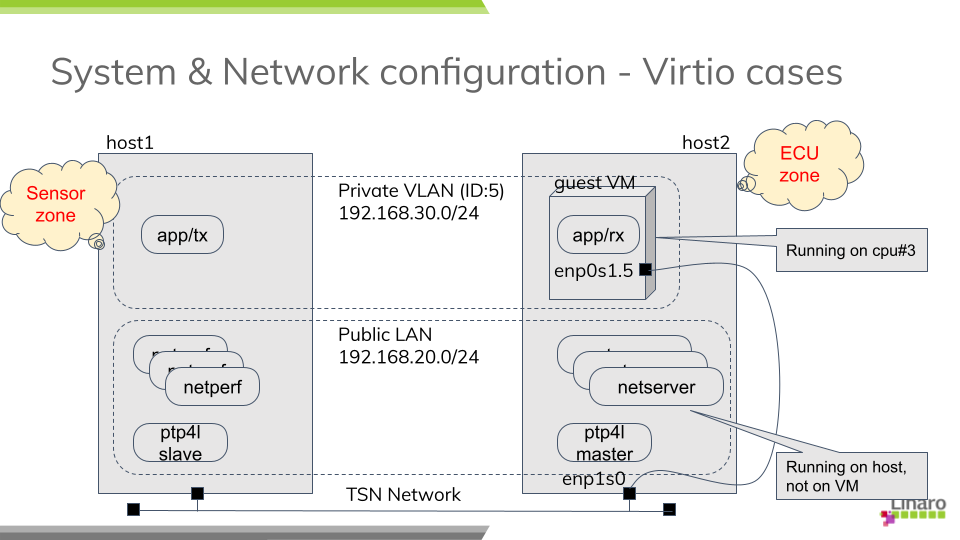
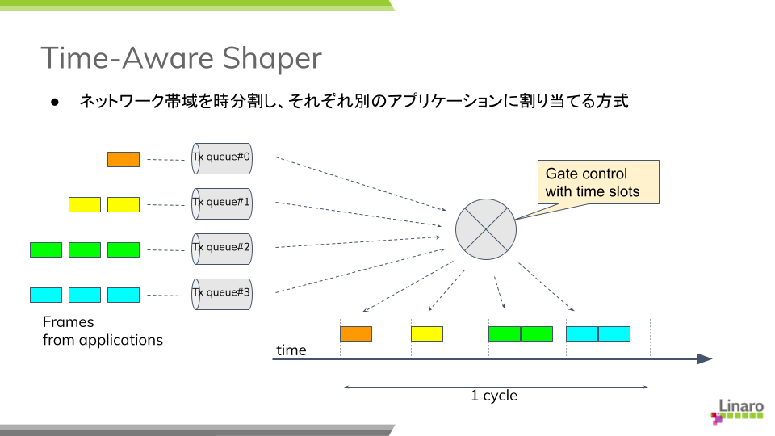
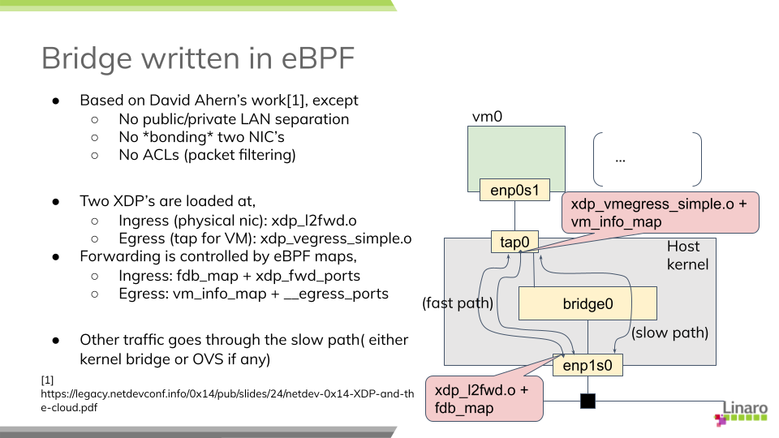

===========================================
Network Latency with TSN on Virtual Machine
===========================================

My last blog article [1]_ described the goal of this research and illustrated
the overview of the evaluation method I have adopted. In the second article of
the series, I would like to present the more details I used in the measurement
process and summerise the results from my experiments against various network
bridge technologies.

Test Scenario
=============

System Overview
---------------

A real automotive system is likely much complicated, consisting a lot of devices,
gateways with a few central servers which are connected with each other via
ethernet routers. In my experiments, however, a much simpler system configuration
is adopted:
Two evaluation boards are directly connected by a cable without using any
intermediate switch as our aim here is to evaluate activities at the VM host side.

============  ========================
Target board  MACCHIATObin Double Slot
NIC card      pcie Intel i225-T1
OS            Debian 11 (bullseye)
Kernel        PREEMPT_RT v6.3-rc2
============  ========================

We use two applications:

A. sample-app-taprio [2]_ as a time-sensitive application

B. netperf(UDP_STREAM) as network stress workload

The program comes from Intel developers as a sample code to demonstrate TSN features
on their (and possibly other vendor's TSN-capable) NIC prodcucts and can work as
a benchmark test for measuring network latency.

It originally support the txtime-assist mode of taprio shaper combined with
hardware-based ETF (Earliest TxTime First) qdisc and, in my experiments, was
customized to utilise the full-offload mode.

The sender(TX) side simply wakes up at a given interval within a given time slot
(see TSN configuration below) and sends out a small test packet. The receiver(RX)
side is to poll for incoming packets and calculate a latency based on
the difference between the TX timestamp in a packet and the RX timestamp
captured by the NIC.
Please note that most of time consumed in a guest OS will be excluded from
the definition of latency here because we want to focus on the overhead which
comes from the VM host OS.
(In this sense, the guest OS need not be RT kernel.)

The sender and the receiver belong to and communicate via a dedicated VLAN. While
this configuration will expectedly make much sense to satisfy QOS requirements under
a more complicated network, I suppose that it will have little impact on
the behaviors at the system like here.

  fig. System overview

PTP Setup
---------

Clock synchronization among the devices and servers over the network is one of key
technologies in TSN and the base for all the other features to coordiate activities
across nodes in a time-sensitive manner.
You need to install a PTP package from the distro (I use linuxptp) and start
the daemon before the tests.

While there are many paramters to define PTP's behavior, I start with using
a predefined profile (for automotive use) from the repository. The daemon is
assigned to a real-time scheduling class to help improve the responsiveness (I'm
not sure it really makes sense.)

+--------+------------------------------------------+
|Profile | automotive-{master,slave}.cfg [3]_       |
+--------+------------------------------------------+
|socket  |     5                                    |
|priority|                                          |
+--------+------------------------------------------+
|process |     1 (SCHED_FIFO)                       |
|priority|                                          |
+--------+------------------------------------------+

TSN Configuration
-----------------

TSN standard defines a couple of shapers and schedulers; Qav (or Credit-Based
Scheduler, CBS) and Qbv (or Time-aware Shaper, TAS) are well known features among
others.
In my experiments, I chose Qbv since the focus here is to ensure that prioritised
packets be timely and predictably delivered with some sort of network latency
guaranteed over the less prioritised traffic.

Qbv provides a mechanism of time-muliplexing traffic flows from various applications.
More specifically, the network bandwidth is divided into several time slots with
constant intervals while all the traffic coming from different application
are set to be classified into different queues or traffic classes.
NIC is scheduled to open the gate for allowed TX queues at any time slot so that
packets will be allowed to transmit only for the assigned period within a cycle.
So the mechanism theoretically assures that the transmission of prioritised packets
are not intefered by other (and even excessive) traffic.

  fig. Time-aware shaper

The definition of gate list can vary from system to system depending on applications
and their requirements. Here I adopt the configuration in the table below and I
assume that the streams from the benchmark program, PTP and netperf are bound to
the TX queues, respecitively, #0, #1 and #3.

The duration times (interval) may be arbitrary, but these odd (and prime) numbers
are chosen not to easily resonate with the kernel tick (4 msec by default).

===== ====== ========
slot# opened duration
      queues time(us)
===== ====== ========
 1     0,1     101
 2     1       103
 3     1,2     109
 4     1,3     190
===== ====== ========

Other Optimisation
------------------

Network bridges under virtio
============================

As I mentioned in my previous article, my study covers the following network bridge
types:

A. tap(kernel bridge)

B. macvtap

C. XDP-based bridge

D. Open VSwitch bridge

E. Open VSwitch + AF_XDP

In this section, I describe how I configure the network for each type of
technologies and then how I start the guest VM's in my experiments.
I prefered to use primitive command tools rather than using a kind of virtual
machine manager like virsh/libvirt so that I can have full control over the test
environment.

tap(kernel bridge)
------------------

Create a VLAN port and a bridge device, then attach the port to the bridge:

.. code-block:: none

   # ip link add link enp1s0 enp1s0.5 type vlan id 5
   # ip addr add 192.168.30.2/24 dev enp1s0.5
   # ip link set enp1s0.5 up

   # ip link add tmpbr0 type bridge
   # ip link set enp1s0.5 master tmpbr0
   # ip link set tmpbr0 up

Then start a guest VM, specifying this device at the kvm command line as follows:

.. code-block:: none

   # kvm -machine virt -cpu host -smp 1 -m 2G ... \
        -netdev tap,br=tmpbr0,id=net0,vhost=on,helper=/usr/lib/qemu/qemu-bridge-helper \
        -device virtio-net-pci,netdev=net0,mac=${MAC_ADDR}

macvtap
-------

Create a macvtap device:

.. code-block:: none

   # ip link add link enp1s0 name macvtap0 address ${MAC_ADDR} \
         type macvtap mode bridge
   # ip link set macvtap0 up

Then start a guest VM, specifying this device at the kvm command line as follows:

.. code-block:: none

   # kvm -machine virt -cpu host -smp 1 -m 2G ... \
        -netdev tap,id=net0,vhost=on,fd=3 \
        -device virtio-net-pci,netdev=net0,mac=${MAC_ADDR} \
        3<> /dev/tap${TAP_NUM}

XDP
---

David Ahern has made a very interesting study [4]_ [5]_ in this area. His interest
may be in the cloud environment, but his approach can also be applied to embedded
systems. Since his sample code is quite useful, I re-use it with a minor change
to fit it into my test purpose.

There are two XDP programs, xdp_l2fwd and xdp_vmegress_simple. They are loaded
and attached to a physical NIC port and a tap device for the guest VM, respectively.
When a packet is to be sent out from the egress port, XDP programs are called out
to determine if any action is needed for that packet using their own database
(or map in XDP term). If the program returns XDP_REDIRECT, the packet will
be directly redirected to another port. If it returns XDP_PASS, the packet will be
simply forwarded to the kernel network stack as usual.

  fig. XDP bridge

If you want to try this case, first download the modified code from my repository [6]_
and build eBPF binaries:

.. code-block:: none

   $ git clone https://git.linaro.org/...
   $ cd iotg_tsn_ref_sw/sample-app-taprio
   $ make

We use a "tap" configuration as a slow data path and so need to set up the network
as in the case of "tap". After that, we can load and two eBPF binaries built
above onto, respectively, the physical NIC and the tap device for the guest.

.. code-block:: none

   # scripts/l2fwd-simple.sh 

In the middle of running this script, you will be asked to start a guest VM:

.. code-block:: none

   # kvm -machine virt -cpu host -smp 1 -m 2G ... \
        -netdev tap,br=tmpbr0,id=net0,vhost=on,helper=/usr/lib/qemu/qemu-bridge-helper \
        -device virtio-net-pci,netdev=net0,mac=${MAC_ADDR}

Open VSwitch
------------

You can use the distro's Open VSwitch package as is. But if you also want to
try Open VSwitch + AF_XDP configuration, it's time for you to compile the code
for yourself because AF_XDP support is yet seen as an experimental feature and
is not enabled by default.

AF_XDP support requires libbpf from 'tools' of the linux repository:
(See more details in OVS's Documentation/intro/install/afxdp.rst)

.. code-block:: none

   $ cd linux's tools/lib/bpf
   $ make
   # make install
   # make install_headers

Then,

.. code-block:: none

   $ git clone https://github.com/openvswitch/ovs
   $ cd ovs
   $ ./configure --prefix=/ --enable-afxdp --with-dpdk=shared
   $ make
   # make install
   # systemctl start openvswitch-switch.service

Create an OVS bridge device:

.. code-block:: none

   # ovs-vsctl add-br tmpovsbr0
   # ovs-vsctl add-port tmpovsbr0 enp1s0
   # ip link set tmpovsbr0 up
   # ip addr add 192.168.20.2/24 dev tmpovsbr0

Then start a guest VM, specifying this device at the kvm command line as follows:

.. code-block:: none

   # kvm -machine virt -cpu host -smp 1 -m 2G ... \
        -netdev tap,id=net0,br=tmpovsbr0,vhost=on,\
         script=/somewhere/ifup-ovs.sh,downscript=/somewhere/ifdown-ovs.sh \
        -device virtio-net-pci,netdev=net0,mac=${MAC_ADDR}

Where ifup-ovs.sh looks like:

.. code-block:: none

   #!/bin/sh
   ovs-vsctl add-port tmpovsbr2 $1
   ip link set $1 up

Open VSwitch + AF_XDP
---------------------

AF_XDP support is a kind of extension to Data Plane Developppment Kit (DPDK) support
and the ovs daemon dedicates a userspace thread, called Poll Mode Driver (PMD),
for polling a network device and most of packet processing in the kernel is
offloaded to it to improve the network performance.
As the thread cosumes an almost 100% of cpu time, another cpu needs to be
*isolated* from task scheduling. Please add a given cpu number to "isolcpus",
2 in this example, in the kernel command line before rebooting the system.

First, install Open VSwitch following the instructions mentioned above and then
start the OVS daemon with dpdk enabled. We probably need to increase a number of
huge pages:

.. code-block:: none

   # sysctl -w vm.nr_hugepages=2000
   # systemctl start openvswitch-switch.service
   # ovs-vsctl --no-wait set Open_vSwitch . other_config:dpdk-init=try
   # systemctl restart ovs-vswitchd.service

The next step is to create a bridge device and configure OVS for AF_XDP:

.. code-block:: none

   # ovs-vsctl -- add-br tmpovsbr0 -- set Bridge tmpovsbr0 datapath_type=netdev
   # ethtool -L enp1s0 combined 3
   # vs-vsctl set Open_vSwitch . other_config:pmd-cpu-mask=0x7
   # ovs-vsctl add-port tmpovsbr0 enp1s0 -- set interface enp1s0 \
        type="afxdp" option:n_rxq=3 other_config:pmd-rxq-affinity="0:3,1:2,0:3"
   # ovs-vsctl add-port tmpovsbr0 vhost-user-1 -- set Interface vhost-user-1 \
        type=dpdkvhostuserclient  options:vhost-server-path=/tmp/vhost-user-1

   # ip addr add 192.168.20.2/24 dev tmpovsbr0
   # ip link set tmpovsbr0 up

Then start a guest VM, specifying this device at the kvm command line as follows:

.. code-block:: none

   # kvm -machine virt -cpu host -smp 1 -m 2G ... \
        -chardev socket,id=char1,path=/tmp/vhost-user-1,server \
        -netdev type=vhost-user,id=mynet1,chardev=char1,vhostforce,queues=1 \
        -device virtio-net-pci,mac=${MAC_ADDR},netdev=mynet1,mq=on \
        -object memory-backend-file,id=mem,size=2048M,mem-path=/dev/hugepages,share=on \
        -numa node,memdev=mem -mem-prealloc"

Latency Comparison
==================

(TBD)

========== ===== ===== ===== ====== ===== ===== ===== ======
bridge     w/o netperf              w netperf
---------- ------------------------ ------------------------
type       min   avg   max   stdev  min   avg   max   stdev
========== ===== ===== ===== ====== ===== ===== ===== ======
tap        0     0     0     0      0     0     0     0
macvtap    0     0     0     0      0     0     0     0
XDP bridge 0     0     0     0      0     0     0     0
OVS        0     0     0     0      0     0     0     0
OVS+AF_XDP 0     0     0     0      0     0     0     0
========== ===== ===== ===== ====== ===== ===== ===== ======

Issues
======

.. [1] https://www.linaro.org/blog/network-latency-with-tsn-on-virtual-machine/

.. [2] https://github.com/intel/iotg_tsn_ref_sw/tree/apollolake-i

.. [3] https://sourceforge.net/p/linuxptp/code/ci/master/tree/configs/

.. [4] https://legacy.netdevconf.info/0x14/pub/slides/24/netdev-0x14-XDP-and-the-cloud.pdf
.. [5] https://people.kernel.org/dsahern/xdp-vs-ovs

.. [6] https://git.linaro.org/people/takahiro.akashi/...
