===========================================
Network Latency with TSN on Virtual Machine
===========================================

My last blog article [1]_ described the goal of this research and illustrated
the overview of the evaluation method I have adopted. In the second article of
the series, I would like to present the more details I used in the measurement
process and summerise the results from my experiments against various network
bridge technologies.

Test Scenario
=============

System Overview
---------------

A real automotive system is likely much complicated, consisting a lot of devices,
gateways with a few central servers which are connected with each other via
ethernet routers. In my experiments, however, a much simpler system configuration
is adopted:
Two evaluation boards are directly connected by a cable without using any
intermediate switch as our aim here is to evaluate activities at the VM host side.

============  ========================
Target board  MACCHIATObin Double Slot
NIC card      pcie Intel i225-T1
OS            Debian 11 (bullseye)
Kernel        PREEMPT_RT v6.3-rc2
============  ========================

We use two applications:

A. sample-app-taprio [2]_ as a time-sensitive application

B. netperf (UDP_STREAM test) as network stress workload

The program comes from Intel developers as a sample code to demonstrate TSN features
on their (and possibly other vendor's TSN-capable) NIC products and can work as
a benchmark test for measuring network latency.

It originally support the txtime-assist mode of taprio shaper combined with
hardware-based ETF (Earliest TxTime First) qdisc and, in my experiments, was
customised to utilise the full-offload mode.

The sender(TX) side simply wakes up at a given interval within a given time slot
(see TSN configuration below) and sends out a small test packet. The receiver(RX)
side is to poll for incoming packets and calculate a latency based on
the difference between the TX timestamp in a packet and the RX timestamp
captured by the NIC.
Please note that most of time consumed in a guest OS will be excluded from
the definition of latency here because we want to focus on the overhead which
comes from the VM host OS.
(In this sense, the guest OS need not be RT kernel.)

+--------+----------------------------------------+
|packet  | 1006 micro seconds                     |
|interval| (See "`TSN Setup`_" for the rationale) |
+--------+----------------------------------------+
|test    |   900 seconds (15 minutes)             |
|duration|                                        |
+--------+----------------------------------------+
|socket  |   7                                    |
|priority|                                        |
+--------+----------------------------------------+
|process |   90 (SCHED_FIFO)                      |
|priority|                                        |
+--------+----------------------------------------+

The sender and the receiver belong to and communicate via a dedicated VLAN. While
this configuration will expectedly make much sense to satisfy QOS requirements under
a more complicated network, I suppose that it will have little impact on
the behaviors at the system like here.

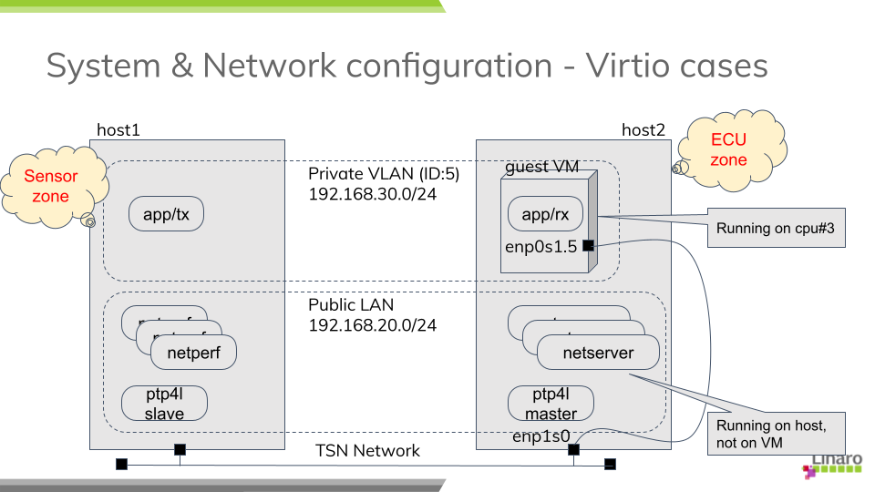

  fig. System overview

PTP Setup
---------

Clock synchronization among the devices and servers over the network is one of key
technologies in TSN and the base for all the other features to coordinate activities
across nodes in a time-sensitive manner.
You need to install a PTP package from the distro (I use linuxptp) and start
the daemon before the tests.

While there are many parameters to define PTP's behavior, I start with using
a predefined profile (for automotive use) from the repository. The daemon is
assigned to a real-time scheduling class to help improve the responsiveness (I'm
not sure it really makes sense.)

+--------+------------------------------------------+
|Profile | automotive-{master,slave}.cfg [3]_       |
+--------+------------------------------------------+
|socket  |     5                                    |
|priority|                                          |
+--------+------------------------------------------+
|process |     1 (SCHED_FIFO)                       |
|priority|                                          |
+--------+------------------------------------------+

TSN Setup
---------

TSN standard defines a couple of shapers and schedulers; Qav (or Credit-Based
Scheduler, CBS) and Qbv (or Time-aware Shaper, TAS) are well known features among
others.
In my experiments, I chose Qbv since the focus here is to ensure that prioritised
packets be timely and predictably delivered with some sort of network latency
guaranteed over the less prioritised traffic.

Qbv provides a mechanism of time-multiplexing traffic flows from various
applications.
More specifically, the network bandwidth is divided into several time slots with
constant intervals while all the traffic coming from different application
are set to be classified into different queues or traffic classes.
NIC is scheduled to open the gate for allowed TX queues at any time slot so that
packets will be allowed to transmit only for the assigned period within a cycle.
So the mechanism theoretically assures that the transmission of prioritised packets
are not interfered by other (and even excessive) traffic.

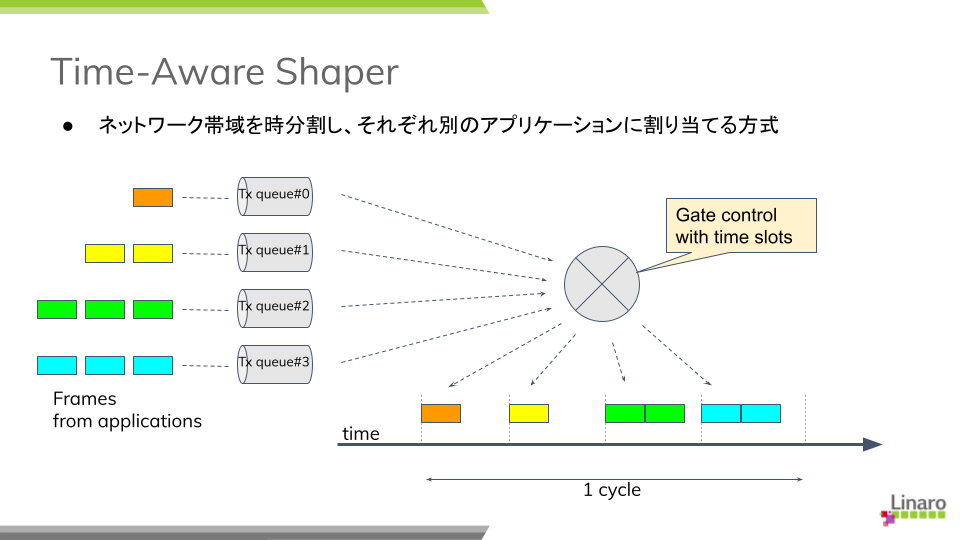

  fig. Time-aware shaper

The definition of gate list can vary from system to system depending on applications
and their requirements. Here I adopt the configuration in the table below to make
streams from the benchmark program, PTP and netperf bound to different TX queues,
#0, #1 and #3, respectively.
So no traffic from different sources are shared and mixed in any single slot
and fully isolated from each other to theoretically, at least at hardware level,
preclude any traffic collision or congestion at any time.

The duration times (interval) of each time slot may be arbitrary, but these odd
(and prime) numbers are chosen not to easily resonate with the kernel tick
(4 msec by default).

===== ====== ========
slot# opened duration
      queues time(us)
===== ====== ========
 1     0,1     101
 2     1       103
 3     1,2     109
 4     1,3     190
===== ====== ========

Other Optimisation
------------------

On top of TSN (Qbv) scheduler,
I found that a couple of additional practices in my experiments are quite effective
and should be applied to get better results.

CPU isolation and affinity
~~~~~~~~~~~~~~~~~~~~~~~~~~

First of all, 
the guest VM running as a user process on the host is at the risk of being
preempted at any time by the host OS/hypervisor, which may end up in the process
being suspended for an unpredictable period.
To avoid this situation, one processor is isolated from the kernel scheduling
and the kvm process is bound to the cpu by masking its CPU affinity list.

Furthermore, in case of OVS + AF_XDP case, we want to additionally allocate more
processors in the isolated-cpu list due to the nature of AF_XDP support.
See "`e. tap + Open VSwitch with AF_XDP`_".

Add the following parameter in the command line.

.. code-block:: none

   isolcpus=nohz,domain,managed_irq,3

Prioritising kernel threads
~~~~~~~~~~~~~~~~~~~~~~~~~~~

It is important to understand how interrupts for received packets are handled
in the host kernel and packets are passed by to the guest VM.
On PREEMPT_RT kernel, a top-half of a device driver (or hardirq) is executed
in a dedicated IRQ thread and then a bottom-half (or softirq) is executed in
a (per-cpu) softirq thread. A softirq may also be called when interrupts are
re-enabled and a cpu exits from an irq context without waking up a softirq
thread.

In a bottom-half, a driver usually invokes a napi framework for polling a network
port and retrieving packets from a RX queue. Depending on a netdev type and its
associated packet handler (a bridge function for instance), an appropriate network
stack will be called out to determine how a received packet should be processed
and where forwarded to.
 
In case of vhost-kernel based virtio-net (it is the case in my experiments except
OVS+AF_XDP case), this will ends up in waking out a per-virtio-net vhost thread
and notifying it of an arrival of packet. Vhost thread is responsible for injecting
a virtual interrupt for the device and kicking up a vcpu for the kvm process.

You see there a couple of context switches may take place before a packet finally
reaches the guest VM. From the viewpoint of real-time aspect, we want to manage
them carefully to cut short of the flow path.
While IRQ threads are running under SCHED_FIFO (priority 90), softirq threads
and vhost threads belong to SCHED_OTHER (time-sharing class) by default.

That said, my early experiments suggest that the bottom-half code is mostly
executed immediately following hardirq, I only put a vhost thread in SCHED_FIFO
after starting the guest VM.

+--------+------------------------------------------+
|vhost   |     1 (SCHED_FIFO)                       |
|priority|                                          |
+--------+------------------------------------------+

Packet filtering with IRQ affinity
~~~~~~~~~~~~~~~~~~~~~~~~~~~~~~~~~~

While the network bandwidth is split by time slots using Qbv scheduler, IRQ
affinity and RSS (Receive Side Scaling) may help distribute the burden by
the kernel stack in packet handling to different processors.

=========== ======== ============
traffic     RX queue IRQ affinity
                     (cpu#)
=========== ======== ============
benchmark    0        2
PTP          1        1
netperf      2-3      0
=========== ======== ============

Set up network bridges under virtio
===================================

As I mentioned in my previous article, my study covers the following network bridge
types:

a. tap (+ kernel bridge)

b. macvtap

c. XDP-based bridge

d. Open VSwitch bridge

e. Open VSwitch with AF_XDP

In this section, I describe how I configure the network for each type of
technologies and then how I start the guest VM's in my experiments.
I preferred to use primitive command tools rather than using a kind of virtual
machine manager like virsh/libvirt so that I can have full control over the test
environment.

a. tap + kernel bridge
----------------------

Create a VLAN port and a bridge device, then attach the port to the bridge:

.. code-block:: none

   # ip link add link enp1s0 enp1s0.5 type vlan id 5
   # ip addr add 192.168.30.2/24 dev enp1s0.5
   # ip link set enp1s0.5 up

   # ip link add tmpbr0 type bridge
   # ip link set enp1s0.5 master tmpbr0
   # ip link set tmpbr0 up

Then start a guest VM, specifying this device at the kvm command line as follows:

.. code-block:: none

   # kvm -machine virt -cpu host -smp 1 -m 2G ... \
        -netdev tap,br=tmpbr0,id=net0,vhost=on,helper=/usr/lib/qemu/qemu-bridge-helper \
        -device virtio-net-pci,netdev=net0,mac=${MAC_ADDR}

b. macvtap
----------

Create a macvtap device:

.. code-block:: none

   # ip link add link enp1s0 name macvtap0 address ${MAC_ADDR} \
         type macvtap mode bridge
   # ip link set macvtap0 up

Then start a guest VM, specifying this device at the kvm command line as follows:

.. code-block:: none

   # kvm -machine virt -cpu host -smp 1 -m 2G ... \
        -netdev tap,id=net0,vhost=on,fd=3 \
        -device virtio-net-pci,netdev=net0,mac=${MAC_ADDR} \
        3<> /dev/tap${TAP_NUM}

c. tap + XDP
------------

David Ahern has made a very interesting study [4]_ [5]_ in this area. His interest
may be in the cloud environment, but his approach can also be applied to embedded
systems. Since his sample code is quite useful, I re-use it with a minor change
to fit it into my test purpose.

There are two XDP programs, xdp_l2fwd and xdp_vmegress_simple. They are loaded
and attached to a physical NIC port and a tap device for the guest VM, respectively.
When a packet is to be sent out from the egress port, XDP programs are called out
to determine if any action is needed for that packet using their own database
(or map in XDP term). If the program returns XDP_REDIRECT, the packet will
be directly redirected to another port. If it returns XDP_PASS, the packet will be
simply forwarded to the kernel network stack as usual.

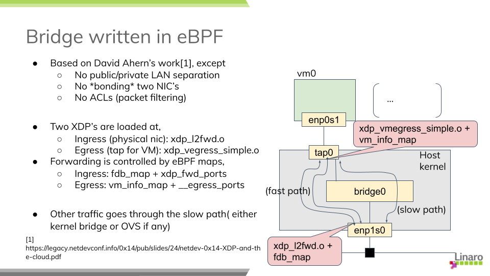

  fig. XDP bridge

If you want to try this case, first download the modified code from my repository
[6]_ and build eBPF binaries:

.. code-block:: none

   $ git clone https://git.linaro.org/...
   $ cd iotg_tsn_ref_sw/sample-app-taprio
   $ make

We use a "tap" configuration as a slow data path and so need to set up the network
as in the case of "tap". After that, we can load and two eBPF binaries built
above onto, respectively, the physical NIC and the tap device for the guest.

.. code-block:: none

   # scripts/l2fwd-simple.sh 

In the middle of running this script, you will be asked to start a guest VM:

.. code-block:: none

   # kvm -machine virt -cpu host -smp 1 -m 2G ... \
        -netdev tap,br=tmpbr0,id=net0,vhost=on,helper=/usr/lib/qemu/qemu-bridge-helper \
        -device virtio-net-pci,netdev=net0,mac=${MAC_ADDR}

d. tap + Open VSwitch
---------------------

You can use the distro's Open VSwitch package as is. But if you also want to
try Open VSwitch + AF_XDP configuration, it's time for you to compile the code
for yourself because AF_XDP support is yet seen as an experimental feature and
is not enabled by default.

AF_XDP support requires libbpf from 'tools' of the linux repository:
(See more details in OVS's Documentation/intro/install/afxdp.rst)

.. code-block:: none

   $ cd linux's tools/lib/bpf
   $ make
   # make install
   # make install_headers

Then,

.. code-block:: none

   $ git clone https://github.com/openvswitch/ovs
   $ cd ovs
   $ ./configure --prefix=/ --enable-afxdp --with-dpdk=shared
   $ make
   # make install
   # systemctl start openvswitch-switch.service

Create an OVS bridge device:

.. code-block:: none

   # ovs-vsctl add-br tmpovsbr0
   # ovs-vsctl add-port tmpovsbr0 enp1s0
   # ip link set tmpovsbr0 up
   # ip addr add 192.168.20.2/24 dev tmpovsbr0

Then start a guest VM, specifying this device at the kvm command line as follows:

.. code-block:: none

   # kvm -machine virt -cpu host -smp 1 -m 2G ... \
        -netdev tap,id=net0,br=tmpovsbr0,vhost=on,\
         script=/somewhere/ifup-ovs.sh,downscript=/somewhere/ifdown-ovs.sh \
        -device virtio-net-pci,netdev=net0,mac=${MAC_ADDR}

Where ifup-ovs.sh looks like:

.. code-block:: none

   #!/bin/sh
   ovs-vsctl add-port tmpovsbr2 $1
   ip link set $1 up

e. tap + Open VSwitch with AF_XDP
---------------------------------

AF_XDP support is a kind of extension to Data Plane Development Kit (DPDK) support
and the ovs daemon dedicates a userspace thread, called Poll Mode Driver (PMD),
for polling a network device and most of packet processing in the kernel is
offloaded to it to improve the network performance.
As the thread consumes an almost 100% of cpu time, another cpu needs to be
*isolated* from task scheduling. Please add a given cpu number to "isolcpus",
2 in this example, in the kernel command line before rebooting the system.

First, install Open VSwitch following the instructions mentioned above and then
start the OVS daemon with dpdk enabled. We probably need to increase a number of
huge pages:

.. code-block:: none

   # sysctl -w vm.nr_hugepages=2000
   # systemctl start openvswitch-switch.service
   # ovs-vsctl --no-wait set Open_vSwitch . other_config:dpdk-init=try
   # systemctl restart ovs-vswitchd.service

The next step is to create a bridge device and configure OVS for AF_XDP:

.. code-block:: none

   # ovs-vsctl -- add-br tmpovsbr0 -- set Bridge tmpovsbr0 datapath_type=netdev
   # ethtool -L enp1s0 combined 3
   # vs-vsctl set Open_vSwitch . other_config:pmd-cpu-mask=0x6
   # ovs-vsctl add-port tmpovsbr0 enp1s0 -- set interface enp1s0 \
        type="afxdp" option:n_rxq=3 other_config:pmd-rxq-affinity="0:3,1:2"
   # ovs-vsctl add-port tmpovsbr0 vhost-user-1 -- set Interface vhost-user-1 \
        type=dpdkvhostuserclient  options:vhost-server-path=/tmp/vhost-user-1

   # ip addr add 192.168.20.2/24 dev tmpovsbr0
   # ip link set tmpovsbr0 up

Then start a guest VM, specifying this device at the kvm command line as follows:

.. code-block:: none

   # kvm -machine virt -cpu host -smp 1 -m 2G ... \
        -chardev socket,id=char1,path=/tmp/vhost-user-1,server \
        -netdev type=vhost-user,id=mynet1,chardev=char1,vhostforce,queues=1 \
        -device virtio-net-pci,mac=${MAC_ADDR},netdev=mynet1,mq=on \
        -object memory-backend-file,id=mem,size=2048M,mem-path=/dev/hugepages,share=on \
        -numa node,memdev=mem -mem-prealloc"

Compare latencies
=================

The table below shows the latency statistics for all bridge types.
The left column holds latencies in the case where only the benchmark program was
executed, and the right column holds latencies when 3 instances of netperf were
also run during the measurements.

Those stats are calculated against an arbitrately-chosen range of data recorded
in the measurements, that is 5 minutes out of the total 15-minute run, so as to
exclude irregular behaviors. You may notice that some result graphs below
suggests that a couple of big spikes of latency may happen or latencies can
go up and down in an extraordinary scale.

I tried to fix those issues but still fail to identify root causes. Since
the weirdness might indicate that there is some problem in the hardware (NIC) or
its driver, I suppose that we have a good reason to exclude a specific portion
of data from the evaluation.
See some discussions in "`Annex-1. Dependency on data range`_" for those known
issues.

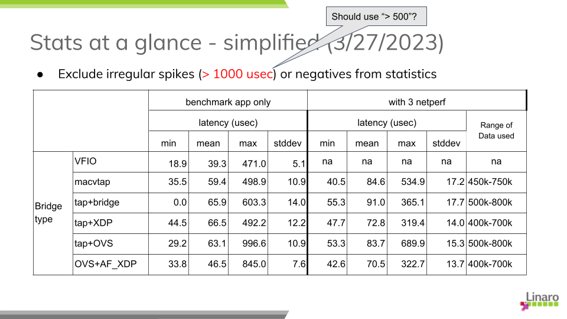

  tab. Latency summary

Looking at those results, especially in netperf cases, we can find out a couple
of insights:

a) Obviously, VFIO outperforms all the other bridge types, but the lead may not
   be so impressive as I expected. Comparing the average latencies, the gap is
   around 7-27 micro seconds in a benchmark-only test and 31-52 micro seconds
   in a heavily-loaded condition with netperf.
   I wouldn't say they are small numbers but they can expectedly be fit into
   acceptable range of latency performance under well-managed environments. 

b) There is merely a subtle disparity in performance
   among different bridge configurations. OVS plus AF_XDP support is the best
   at the average and XDP is the second in this table, but I know that the results
   can easily vary from measurement to measurement.

c) The jitter is another factor to characterise the stability and reliability of
   packet delivery. The standard deviation in this table may represent a sort of
   latency jitter (a degree of diversity among sampled latencies).
   It gets slightly worsen by 2-5 milli seconds comparing to the one in
   a benchmark-only test but it stays narrow in general given a total number of
   sample data.

d) Regarding the worst-case (maximum) latency, the result looks a bit disappointing.
   While most sample data fall into a range under 100 micro seconds as the jitters
   may suggest, a not small number of samples exceeds 200 micro seconds, even
   reaching nearly 400.
   It's worth noting, however, that the delay over 500 micro seconds, which is
   a configured Qbv cycle time, mostly stems from the reality that a packet was
   not transmitted as intended by missing out a first-available time slot at
   the sender's TSN (Qbv) scheduler.

Here are the graphs which plot latencies in time sequence for each bridge type.
You can confirm that all the charts expose a similar characteristics except for
a few singular samples as mentioned above. None of bridge types indicates
that it has a trivial advantage over the others under my test environment. 

(TODO: Add histograms on right sides.)

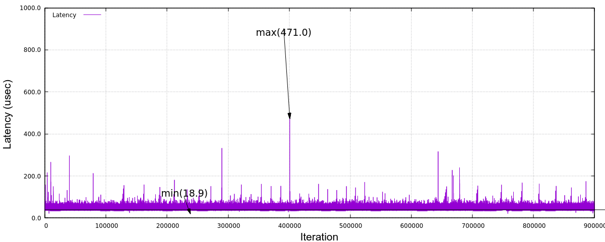

  fig. Latency (VFIO)

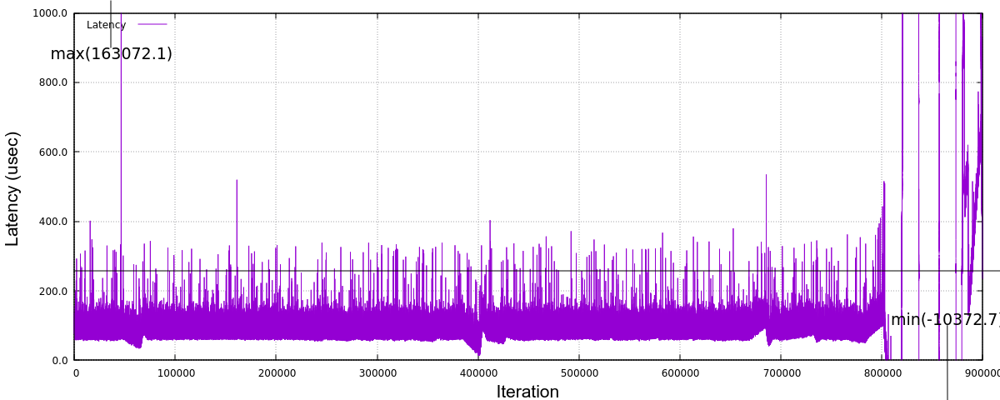

  fig. _`Latency (Macvtap)`

.. figure:: fig_lat_tap_0316_2.png
  :alt: Latency (tap+kernel bridge)
  :width: 1200
  :align: center

  fig. Latency (tap+kernel bridge)

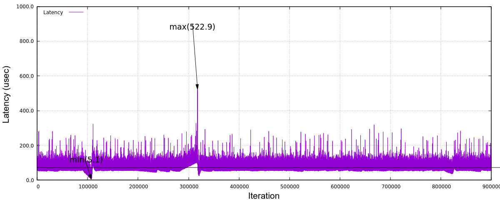

  fig. Latency (tap+XDP)

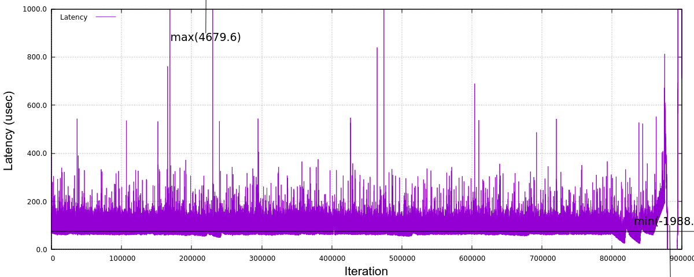

  fig. Latency (tap+Open VSwitch)

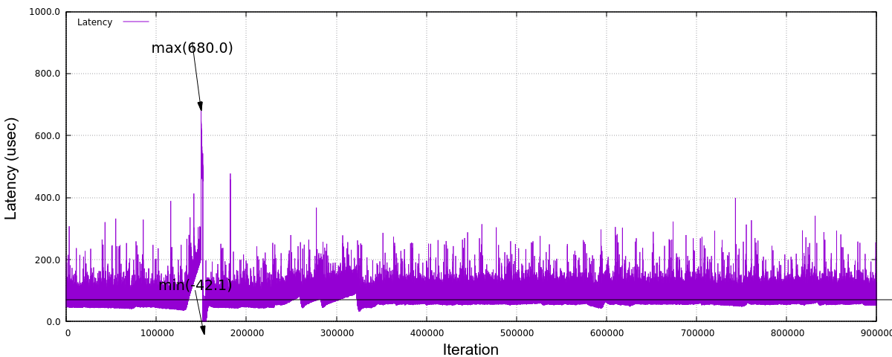

  fig. Latency (tap+Open VSwitch/AF_XDP)

Step up this study
==================

The aim of this study was to pick up some of popular and/or promising bridge
technologies, demonstrate how they behave under the virtual machine environment
and then characterise the nature of network performance metrics, in particular,
latency. 
The comparison result in the previous section, however, may have fallen short in
satisfying your expectation. For instance, when I took on this task, some engineer
said that XDP approach could potentially outperform the existing bridge
technologies, but this is not the reality as far as my experiments are concerned.

This is probably because the test scenario I adopted here was too simple
to differentiate one from the others. Only a single guest VM was hosted on
the controller side and merely a small size of packets are transmitted in as slow
an interval as 1 milli seconds. There is no other device, gateway nor switch
in the middle of network. And yet a good enough width (20% of the total bandwidth)
of time slot in Qbv is allocated for the benchmark stream.
A real system in a car must be more complicated by many hosted applications with
various level of requirements and hence there will be stretched restrictions
against system/network configuration.
It's not surprising if we may witness slightly different behaviors under complex
conditions.

On the other hand, from the viewpoint of real-time systems, we need to pay
more attention to maximum latencies in order to guarantee a reliable delivery
of packets. So I'm going to continue to investigate where the jitters may come
from and identify the root causes of big spikes and PTP (network) disorder
which can irregularly happen even in the current test environment.

In the section "`Other optimisation`_", I mentioned a couple of hints and tips
in tuning the system to acquire the best result with some accuracy and stability.
While I have concentrated on the overhead and interferences imposed by the host OS
or the hypervisor, the total end-to-end latency, I mean up to the time a packet
reaches the application in user space, should be a final target.
As the histogram below shows,

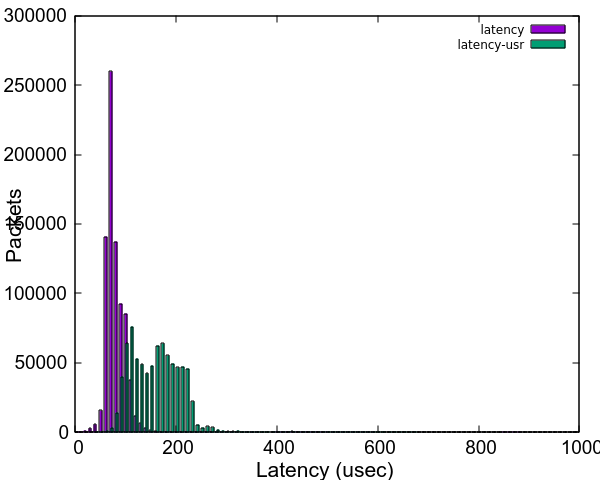

  fig. End-to-end latency histogram (tap+kernel bridge)

we see even more divergence in end-to-end latencies, shown as "latency-user" in
the graph, due to the guest OS which is also a PREEMPT_RT linux in this case.
(Please note that the CPU which houses the guest VM is fully isolated from
the host kernel's scheduler.)
It is no doubt another key point to evaluate when it comes with system-wide tunings.

In addition, I would like to add one more metric in the test; a latency in the
opposite direction, that is, from the application on the guest VM to the remote
host.
This case corresponds to a control message issued by ECU in a real automotive
system and should require a real-time character as well. I suppose that it must
be much harder to ensure that a packet is delivered in a reliable manner.

Finally, this study is a still on-going effort.
As I mentioned in my last blog article, it is very much crucial for me to get more
feedbacks and comments from real users who are challenging at their real-time
systems using TSN technology to help establish a proven test methodology and
acquire more sensible and trustworthy outcomes from the experiments.
I'm seriously looking forward to hearing from readers of this article.

Annex-1. Dependency on data range
=================================

The weird behaviors seen in the results include

* The latency rises sharply and drops off in a small period

* The latency fluctuates in a huge scale for a long period

For instance, see the graph in the figure below. It illustrates the same data in
figure "`Latency (Macvtap)`_", but in a different scale at y-axis to show
the whole range of data.

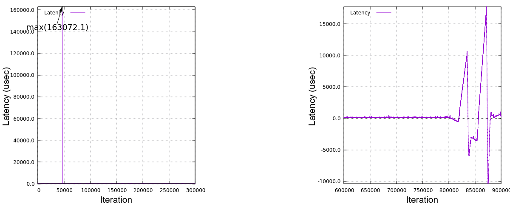

  fig. Latency (Macvtap) in different scale

A big spike of latency reached up to 160 milli seconds and it is also sometimes
seen that rather big spikes (around 6 milli seconds) occur in a periodic manner,
say, at every one minute. The timestamp record shows that all the packets were
sent out at expected time but the delivery on the receiver side seemed to be
delayed (for a few milli seconds) and all the packets were suddenly received
almost at once. This explains why the latencies were linearly declined.

Meanwhile, the latency may swing between a large minus and a large plus and
this happened either in a smaller scale and in a bigger scale.
In all cases, the degree of increasing or decreasing looks *proportional* in
a few minutes.
Thinking of the fact that PTP clock synchronisation is managed by PI (Proportional
Integral) controller's servo, this kind of behavior can be explained by an improper
adjustment of clock frequency against clock's drifting.

I want to exclude all these irregular values from statistics to understand
static and average behaviors. while it is crucial to eliminate any possibility
of big latencies in real-time applications, it's a bit beyond the scope of my study
here.

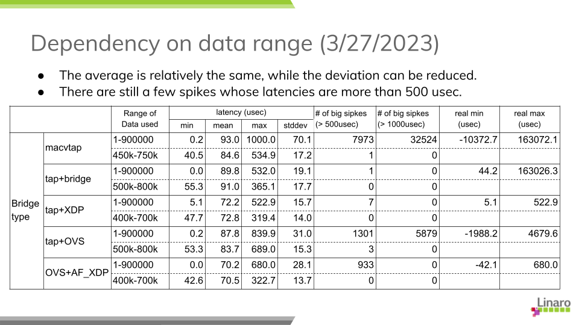

  tab. Data range and Latencies

Here is the stats comparison; one for using the whole data in 15-minute run
and the other against a 5-minute portion where the latencies are relatively
stable.
Obviously the maximum latency drops, while the average is almost the same
and the standard deviation can be reduced which I believe reflects a general
character of the graphs.

.. [1] https://www.linaro.org/blog/network-latency-with-tsn-on-virtual-machine/

.. [2] https://github.com/intel/iotg_tsn_ref_sw/tree/apollolake-i

.. [3] https://sourceforge.net/p/linuxptp/code/ci/master/tree/configs/

.. [4] https://legacy.netdevconf.info/0x14/pub/slides/24/netdev-0x14-XDP-and-the-cloud.pdf
.. [5] https://people.kernel.org/dsahern/xdp-vs-ovs

.. [6] https://git.linaro.org/people/takahiro.akashi/...
